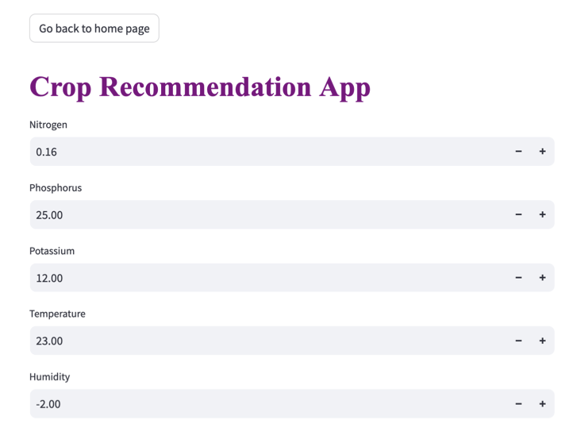

# Smart-farming

# Crop Recommendation System

This project provides recommendations for 22 different crops based on several environmental and soil parameters such as humidity, pH, rainfall, temperature, nitrogen (N), phosphorus (P), and potassium (K) content.

## Features

- **Crops Included**: Apple, Banana, Coffee, Cotton, Grapes, and 17 others (22 crops in total).
- **Parameters Used**: Humidity, pH, Rainfall, Temperature, Nitrogen (N), Phosphorus (P), and Potassium (K).
- **Machine Learning Models**:  
  - Decision Trees  
  - Logistic Regression  
  - Random Forest  
  - Naive Bayes  
  - XGBoost (Achieved 99% accuracy)

## Highlights

- XGBoost performed the best, achieving an accuracy of 99%.
- An interactive web interface has been built using **Streamlit**, allowing users to input the parameters and receive crop recommendations instantly.

## Web Interface

The **Streamlit** web application allows users to:
- Input soil and environmental parameters.
- Receive real-time crop recommendations based on the input values.

## Output

# Fertilizer Prediction

# Fertilizer Prediction System

This project implements the prediction of fertilizers based on several agricultural and environmental parameters. It aims to assist farmers in determining the most suitable fertilizer to use based on specific conditions to maximize crop yield and soil health.

## Overview

- **Fertilizers Predicted**: Urea, DAP, 20-20, 28-28, and 3 other fertilizers (7 fertilizers in total).
- **Parameters Used**: Temperature, Humidity, Moisture, Soil Type, Nitrogen, Potassium, Phosphorus, Crop Type.

## Features

- **Prediction of Fertilizers**: The model predicts which fertilizer to use based on the given parameters.
- **Model**: Random Forest model with a high accuracy of **95%**.
- **Interactive Webpage**: Created an interactive user interface using **Streamlit** for ease of use.

## Models Used

- **Random Forest Classifier**: Chosen for its accuracy and performance in handling the complex relationships between the parameters and the fertilizers.

## How to Use

1. Input the required parameters such as temperature, humidity, soil type, etc., in the interactive webpage.
2. The model will predict the most suitable fertilizer for the crop.

## Accuracy

The Random Forest model achieved an accuracy of **0.95** in predicting the appropriate fertilizer.

## Web Application

The project includes a **Streamlit** web application that provides an intuitive interface for users to input data and receive fertilizer predictions in real-time.

## Requirements

- Python 3.6+
- Streamlit
- Scikit-learn
- Pandas
- Numpy

## Output

# Plant Disease Prediction

# Crop Disease Prediction System

This project implements a system for predicting crop diseases based on images provided by the user. It covers 26 different diseases across 14 different plants, helping farmers diagnose plant diseases efficiently and accurately.

## Overview

- **Diseases Predicted**: Late Blight, Black Rot, Target Spot, Leaf Blight, and 22 more diseases (26 diseases in total).
- **Plants Covered**: 14 different plant species.
- **Input**: The model predicts diseases based on images uploaded by the user.

## Features

- **Image-based Disease Prediction**: The system uses an image provided by the user to predict the type of disease affecting the crop.
- **Model**: A **Convolutional Neural Network (CNN)** was developed for this task.
- **Interactive Webpage**: Built an easy-to-use interface using **Streamlit** for users to upload images and receive predictions.

## Models Used

- **Convolutional Neural Network (CNN)**: Chosen for its ability to learn from image data and effectively classify diseases in plants.

## How to Use

1. Upload an image of the crop showing visible signs of disease.
2. The CNN model will predict the most likely disease based on the input image.

## Web Application

The project includes a **Streamlit** web application, which provides an intuitive interface for users to upload crop images and receive real-time disease predictions.

## Requirements

- Python 3.6+
- Streamlit
- TensorFlow/Keras
- OpenCV
- Numpy
- Pandas

## Output

# How to run Streamlit 
streamlit run app.py
